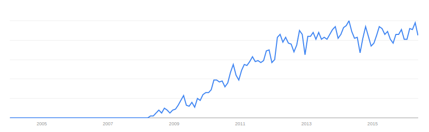
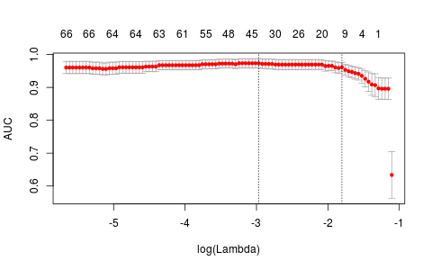
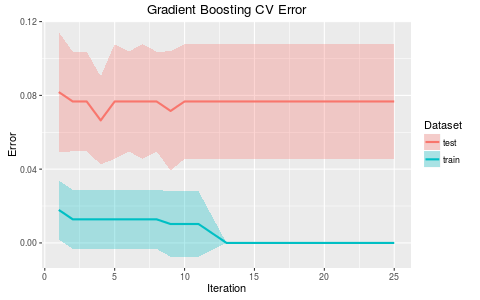

# Abstract

RNA sequencing (RNA-seq) analysis allows us to measure and analyze gene expression levels in cells. Gene expression is well accepted to be one of the most fundamental methods by which the genotype translates to observable traits. As such, this type of analysis has become a popular (see Figure 1) method by which biostatisticians can identify associations between observed traits and gene expression levels. In the paper *A Machine Learned Classifier That Uses Gene Expression Data to Accurately Predict Estrogen Receptor Status* by Bastani et al., the authors create an RNA-based classifier of the estrogen receptor (ER) status of tumors of breast cancer patients. In this paper I critique and attempt to replicate their work as well as create a set of machine learning classifiers to benchmark their results. 

# Biological problem

From the authors:

> Invasive breast adenocarcinoma is a common cancer whose clinical management is guided by predictive biomarkers. In particular, clinicians rely on the predictive value of tumor Estrogen Receptor (ER) status to decide whether to apply endocrine therapy.

Tumors with high concentrations of ERs (ER+) are more likely to react to endocrine therapy, while ER- tumors typically only react to alternative methods such as cheomtherapy. By determining the ER-status of a patient we can better choose which treatment to apply to derive the most benefit to the patient.

At the time this paper was written (2013), the standard practice for determining ER-status was "immunohistochemical (IHC) testing". This method gave the incorrect results 20% of the time as determined by an "international expert panel." The goal of Bastani et al. was to develop an RNA-based classifier of ER-status that was more accurate and less subjective than the IHC.

# Data

To achieve this end, the authors collected 199 breast cancer tumors from the Canadian Breast Cancer Tumor Bank. Curiously, the ER-status of these tumors was determined using IHC, the same method this classifier is attempting to replace. To give the authors the benefit of the doubt, I'll assume that the reason for the high levels of inaccuracy in IHC tests is sloppy lab work and not that the test is fundamentally flawed. Indeed, the authors mention that their IHC tests were "guideline-standardized" and "in complete accordance with the ER-status determined by a panel of 7 pathologists during the initial breast cancer diagnosis."

The authors have released this data through GEO Series accession number **GSE29210**. The details of the RNA sequencing are as follows:

> This RNA was subjected to linear amplification and Cy3 labeling and hybridization to Agilent Whole Human Genome Arrays using Agilent kits (One Color Low RNA Input Linear Amplification Kit Plus, One Color RNA Spike-In Kit and Gene Expression Hybridization Kit) according to the manufacturer's recommended protocols. After the arrays were scanned using an Agilent Scanner, the data was extracted and the quality evaluated using Feature Extraction Software 9.5 (Agilent). The data was normalized and analyzed using GeneSpring GX 7.3.1 (Agilent).

Each tumor is considered an observation, and each "oligonucleotide" is a feature. They point out that "each gene is represented by one or more features."

### Issues with Reproducing their Work

Their work involved learning a linear classifier of $ER$ status using the FS_SVM algorithm. While the details of this algorithm are not within the scope of this paper, it can be said that FS_SVM is a feature-selecting version of the Support Vector Machine algorithm. Their final classifier was:

$ER+ if \ 0.2488 \times Ex(AW97281) - 1.2934 \times Ex(CA12) - 2.2165 \times Ex(GATA3) < 1.8993$

$ER-$ Otherwise
\newline

The authors reported a training set cross-validation accuracy of $93.17 \pm 2.44\%$ and a test set accuracy of 22/23=95.65%.

The training and test sets were pre-determined by the authors and recorded in the metadata file. The first thing to note about the data available through GEO is that 3 of the 23 test observations were all missing values. Even worse, 13,312 features were only present in the testing data and not the training data. Removing these features from the entire data set resulted in 27,688 features, presumably the same 27,688 cited in the paper. They mention that they filtered the test set to only include the 27,688 present in the training data but it is not immediately clear why those features were distributed with the GSE file.

The authors describe the process by which the data were normalized:

> The value of each feature in each array was [N1] baselined to 0.1 (each value less than 0.1 was replaced with 0.1), [N2] normalized per array (each measurements on each array was divided by the 50th percentile value for that array) and then [N3] normalized per feature (each feature was divided by the median of its measurements in all samples). The N1–N3 normalization steps are performed by the GeneSpring software. We then [N4] transformed the data into z-scores, by subtracting from each feature value  the mean for this j-th feature $\mu_j$, then dividing by the standard deviation $\sigma_j$ for that feature; hence each transformed feature has zero mean and unit variance over the dataset.

The authors write that data were normalized by [N1]-[N4] separately for training and test for their analysis. I think learning the statistics used in the normalization from the training set then applying them to the test set would have been a better choice. The most glaring issue from their work though is that one of the necessary features of their model, "A_32_P104334 (AW97281)", is one of those that is absent from the training set. It is important to point out that this was verified before performing any preprocessing on their data. To restate their feature filtering methods:

> Features were then filtered to include only those that were annotated with a GenBank accession number and were present in at least 44 of the E176 training samples; this produced a set of 27,688 features

How could they have produced that classifier if one of the three features it selected was not present in the *training* data? I have checked this assertion many times in different ways and still come up with this result. Nonetheless, I still wanted to see if I could reproduce their results on the test set. After all, I already had their closed-form classifier and the normalization process did not depend on the training data. 

Surprisingly, their equation correctly predicted 19/20 test samples for a accuracy of 0.95, consistent with their results. This likely indicates that my preprocessing accurately reflected the preprocessing the authors did on this data. When I began fitting my own models however, I noticed they were predicting very well on the training set but very poorly on the test set. I believe there are two possible reasons for that:

1) I was overfitting the training data. But I used two methods (LASSO regression and Random Forest) that are designed to combat overfitting. LASSO in particular doesn't usually overfit, at least not this badly.

2) The data between training and testing were different. This could be because they actually were very different when they were given to me. If the data were from two different statistical populations, then a model fit on one population would certainly not generalize to another population. Another possibility was that the normalization process created differences in the data that the models could not overcome. 

Specifically, Naive Bayes gave a test accuracy of 0.6 (by predicting every observation ER+). LASSO, with the $1 SE$ value of $\lambda$, gave a training accuracy of 0.9 but a test accuracy of 0.55. Finally, a Random Forest gave a test accuracy of 0.6 but an Out-of-Bag (OOB) accuracy of 0.93. It has been stated many times that the OOB error is an unbiased estimate of the true error rate of a Random Forest, although in certain cases it actually *overestimates* the true error (see Mitchell, 2011). If this is the case, why is there such a discrepancy between the OOB error and the test error? My conclusion is that the training and test data represent two different statistical populations, either through the ill-advised methods the authors used to normalize the data or a flaw somewhere in the data collection process. 

It should be noted that I did not optimize the hyperparameters of the Random Forest. A more careful analysis should have done so, but the purpose of this Random Forest was to compare the OOB error to the test error. Nevertheless, Mitchell shows that the OOB error can be thought of as an *upper-bound* on the true error rate, so the effect of tuning parameters should have been minimal and would not have affected my conclusion.

# Statistical Methods

Abandoning the methodology of the paper, I simply used their raw data, unnormalized. I thought methods that implement Bootstrapping would be best for this dataset with so few observations, so I did not proceed further with Naive Bayes. I settled on 3 algorithms to compare: LASSO, Random Forest, and Gradient Boosted Trees. The full dataset was 196 observations of 27,688 features after removing the null observations and features with missing values. I made my own training and test sets with a roughly 67-33 split resulting in 147 training observations and 49 test observations. The original training/testing indicator that came with the GEO data was ignored.

The simplicity with which the authors were able to delineate ER-status should not be overlooked. Their classifier only used 3 genes to separate patients based on ER-status. A more careful examination however would recognize that it took all the data to normalize those features. Nonetheless, as the authors encountered when attempting to validate their model on other datasets, RNA sequencing isn't perfect and a simpler model gives more portability to other RNA-seq platforms.

# Results

### LASSO

The LASSO model was fit using `glmnet` and 10-fold cross-validation driven by AUC (C-statistic) to determine $\lambda$. Figure 2 shows the $\lambda$s plotted against the AUC along with vertical lines at the $\lambda$ producing the maximum AUC (lambda-min) and the $\lambda$ within 1 standard error of the maximal value (lambda-1se). I used lambda-1se to fit the final model, a practice sometimes used to control overfitting.

This 11-term model gave a training accuracy of 0.87 and a test accuracy of 0.90. It predicted 5 observations as $E+-$ that were actually $ER-$, or false negatives. This gave perfect sensitivity of 1 and specificity of 0.72. 

### Random Forest

I fit a Random Forest with default parameters, except since the data was so wide I set the number of trees to 500 instead of 100 to give more variables a chance to be represented in the model. This gave a training accuracy of 1 and a test accuracy of 0.92, so slightly overfit but a little better than the LASSO still. The variable importances did not align with the results from the paper so that plot was left out. The OOB accuracy was 0.90, which supports the conclusion that the original train/test split and/or normalization process was bogus because this is closer to the "true" error rate of 0.92. The Random Forest also acheived a sensitivity of 0.97 and a specificity of 0.83. 

### Gradient Boosted Trees

Since Gradient Boosted Trees are such a good predictor, I simply wanted to use them as a benchmark for the previous two models as well as the results from the paper. It should be noted that since my test set is larger than theirs this is not a one-to-one comparison as it is difficult to say how their model would have performed on my test set. Since I only wanted to use this model for benchmarking, I fed it the whole dataset and allowed it to perform 3-fold cross-validation internally. This gave me less control over how the data were split as well as less information about *how* the model might be missing, but was a great way to select the "optimal" model based on CV error.

I ran 25 rounds with a learning rate of 0.05 and limited the depth of the trees to 5. The best iteration gave a training accuracy of 0.99 $\pm$ 0.02 and a test accuracy of 0.93 $\pm$ 0.02. This is fairly consistent with the Random Forest and LASSO models. Figure 3 shows how the error rates and standard errors behave through the boosting iterations.

# Conclusions

These results are fairly consistent with the results from the Bastani et al. paper. It is interesting to see that across different modeling techniques the classification error stays about the same. I should point out that their data being open and accessible is great for promoting open science, but their results were not reproducible given the data they released. Specifically, a feature was missing from the training set that was allegedly used to build the model and 3 observations from the test set were seemingly obfuscated. There is an outside chance that I am misunderstanding this data, and if that is the case then there should be better documentation released with these data sets. For example, I know the data was not [N1]-[N4] normalized beforehand because it did not have 0 mean and unit variance, however I do not know if the data was log-transformed as they mention in their paper.

Additionally, these models should be tuned to reduce false positives if they were to be used in a clinical setting. Imagine a patient who is truly $ER-$ but we predict to be $ER+$. They will get ineffective treatment, so we should only classify people as $ER+$ if we are really sure. It is possible to do that with these models as they output *probabilities*, i.e. they are *soft classifiers*. The model from the paper is a *hard classifier*, meaning it only outputs $ER+$ or $ER-$. When constructing my model results, I simply accepted the default classification cutoff of 0.5. Considering that the classes were slightly imbalanced, I perhaps should have used a different cutoff. This is a typical problem in classification tasks however in that the use-case for the model should determine what that cutoff is. In our case, as I alluded to, it should probably be a little higher than what some modelers might consider "optimal", or the value that "best" balances sensitivity and specificity. 

On the other hand, there is a cost to consider with administering harsh chemotherapy to a patient who would actually be receptive to hormone treatment. The balance of these two evils is more of an ethical question than a statistical one, but a soft classifier for estrogen receptor status would allow greater control over managing those risks. 

# References 

Bastani M, Vos L, Asgarian N, Deschenes J et al. A machine learned classifier that uses gene expression data to accurately predict estrogen receptor status. PLoS One 2013;8(12):e82144. PMID: 24312637

M. Mitchell, "Bias of the Random Forest Out-of-Bag (OOB) Error for Certain Input Parameters," Open Journal of Statistics, Vol. 1 No. 3, 2011, pp. 205-211. doi: 10.4236/ojs.2011.13024.

Davis, S. and Meltzer, P. S. GEOquery: a bridge between the Gene Expression Omnibus (GEO) and
  BioConductor. Bioinformatics, 2007, 14, 1846-1847
  
Jerome Friedman, Trevor Hastie, Robert Tibshirani (2010). Regularization Paths for Generalized
Linear Models via Coordinate Descent. Journal of Statistical Software, 33(1), 1-22. URL
http://www.jstatsoft.org/v33/i01/.

Tianqi Chen, Tong He and Michael Benesty (2016). xgboost: Extreme Gradient Boosting. R package
  version 0.4-3. https://CRAN.R-project.org/package=xgboost
  
A. Liaw and M. Wiener (2002). Classification and Regression by randomForest. R News 2(3), 18--22.

H. Wickham. ggplot2: Elegant Graphics for Data Analysis. Springer-Verlag New York, 2009.